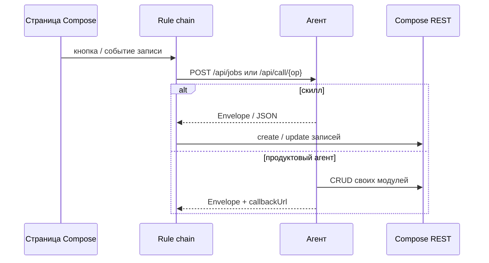

# Руководство разработчика агентов

Как добавить вычислительный сервис рядом с платформой: контракт SDK, HTTP, палитра rule chains, пространство Compose и поставка в Docker. Архитектура — в [architecture.md](architecture.md), стенды — в [deploy.md](deploy.md).

Аудитория: человек, который пишет новый агент или скилл на Go и подключает его к Compose.

---

## 1. Что такое агент

Агент — отдельный процесс. Платформа хранит данные и UI; агент делает то, чего нет в low-code блоках (скан сети, бэкап, EVM, растеризация PDF).

Два масштаба:

| | **Скилл** | **Продуктовый агент** |
|--|-----------|------------------------|
| Примеры | `calc-evm`, `scan-cidr` | `backup`, `cmdb`, `stroykontrol` |
| Записи Compose | не пишет | читает/пишет свои модули |
| UI | нет | страницы namespace и/или своя страница |
| Вызов | узел rule chain | то же + кнопки на карточках |
| Каталог | `agents/services/<имя>/` | `agents/<имя>/` |

Пространство (`/ns/backup`) — продукт. Скилл — один узел в цепочке этого продукта. `scan-cidr` не создаёт устройства: их пишет цепочка `cmdb-ingest-scan`.

`invest` — исключение: свой chi-роутер, без `sdk.Service`. Новый код так не начинайте, если хватает SDK.



---

## 2. Контракт `lowcode.agent.v1`

Пакет: `github.com/madnikulin50/lowcode/agents/sdk` (`agents/sdk/`).

Сервис поднимает chi и отдаёт одни и те же маршруты:

| Метод | Путь | Назначение |
|-------|------|------------|
| GET | `/health`, `/api/health` | liveness |
| GET | `/api/meta` | handle, capabilities, дескрипторы узлов |
| POST | `/api/jobs` | старт операции (`operation` + параметры) |
| GET | `/api/jobs`, `/api/jobs/{jobID}` | список / статус |
| GET | `/api/jobs/{jobID}/items` | выборка `items` (устройства скана и т.п.) |
| POST | `/api/call/{op}` | синхронный вызов |
| POST | `/api/register` | heartbeat в модуль агентов |

Тело старта (`StartRequest`): канонические поля снимаются в структуру, остальное — `Params`.

```json
{
  "operation": "scan",
  "namespaceID": "5123…",
  "recordID": "…",
  "callbackUrl": "http://server/…",
  "cidr": "192.168.1.0/24"
}
```

Канонические ключи: `operation`, `jobID` / `jobId`, `recordID` (и алиасы `createdRecordID`, `scanRecordID`, `jobRecordID`), `namespaceID`, `token`, `callbackUrl` / `callbackURL`. Остальное (`cidr`, `sourceID`, `items`) доступно как `req.Param("cidr")` / `j.Param("cidr")`.

Ответ и колбэк — `Envelope` (`schema: "lowcode.agent.v1"`):

| Поле | Смысл |
|------|--------|
| `service`, `operation` | кто и что |
| `id` / `jobID` | идентификатор джобы |
| `status` | `pending` / `running` / `completed` / `failed` |
| `kind` | `progress` / `complete` / `failed` |
| `progress`, `message`, `error` | ход и ошибка |
| `namespaceID`, `recordID` | контекст Compose |
| `result` | плоский объект метрик |
| `items` | массив сущностей для ingest |

При сериализации SDK дублирует старые имена (`scanID`, `createdRecordID`, `jobRecordID`), чтобы не ломать существующие цепочки. Новые цепочки читайте канонические поля.

Прогресс на колбэк троттлится (не чаще раза в 2 с). Финальный `complete` / `failed` уходит сразу, таймаут POST — до 90 с.

---

## 3. Выбор режима

**Синхронный** — чистая функция, ответ за секунды, цепочка сама пишет записи.

```go
svc := sdk.New(sdk.Config{Handle: "calc-evm", Name: "EVM calculator", Listen: ":8088"})
svc.Register(components()...)
svc.Sync("evm")
svc.UseSync(func(ctx context.Context, op string, req sdk.StartRequest) (any, error) {
    in, err := InputFromParams(req.Param("projectID"), req.Params)
    if err != nil {
        return nil, err
    }
    return Run(in), nil
})
_ = svc.Listen(context.Background())
```

Эталон: `agents/services/calc-evm/cmd/calc-evm/main.go`.  
Вызов: `POST /api/call/evm`. `Sync("evm")` делает то же через `POST /api/jobs` с `operation=evm`.

**Асинхронный** — долгое сканирование, бэкап. Сразу `202`-подобный Envelope `running`, работа в горутине, `SetProgress` / `SetItems`, в конце колбэк.

```go
svc.UseAsync(func(ctx context.Context, j *sdk.Job) error {
    cidr := j.Param("cidr")
    devices, err := scanner.Scan(ctx, cidr, func(cur, total int, ip string) {
        j.SetProgress(float64(cur)/float64(total)*100, ip)
    })
    if err != nil {
        return err
    }
    j.SetItems(devices)
    j.SetResult(map[string]any{"found": len(devices)})
    return nil
})
```

Эталон: `agents/services/scan-cidr/cmd/scan-cidr/main.go`.  
`j.SetProgress` сам шлёт progress на `callbackUrl`.

**Свой Backend** — если состояние джоб живёт в домене (как backup), реализуйте `sdk.Backend` и `svc.SetBackend(ag)`. Опционально: `SyncBackend`, `ItemsBackend`, `HealthBackend` (`agents/sdk/http.go`).

`Alias(method, path, operation)` вешает старые URL на ту же джобу (`POST /api/restore` → `operation=restore`). Статические пути регистрируйте до параметризованных — SDK сортирует алиасы сам.

---

## 4. Дескрипторы и палитра

`GET /api/meta` отдаёт `Descriptor` каждой операции. Сервер подмешивает их в редактор rule chain (см. `server/compose/rest/rulechain_agent_nodes.go`, `fetchLiveAgentNodeTypes`).

```go
sdk.Desc{D: sdk.Descriptor{
    Type:        "scan/cidr",
    Label:       "Scan CIDR",
    Description: "ICMP/TCP/ARP. Не пишет в Compose.",
    Category:    sdk.CategoryAction,
    Execution:   sdk.ExecRemote,
    Async:       true,
    Service:     "scan-cidr",
    Operation:   "scan",
    ConfigFields: []sdk.Field{
        {Key: "cidr", Widget: "string", Label: "CIDR", Required: true, Template: true},
        {Key: "namespaceID", Widget: "string", Label: "Namespace ID", Template: true},
    },
}}
```

| Поле | Зачем |
|------|--------|
| `Type` | id узла в цепочке (`scan/cidr`, `backup/run`) |
| `Service` + `Operation` | маршрутизация `service.call` и `/api/jobs` |
| `Async` | цепочка не ждёт тело ответа |
| `Template` на поле | в UI можно `{{recordID}}`, `{{cidr}}` |
| `Category` | `filter` / `transform` / `action` / `external` / `endpoint` |

Типизированные узлы, зашитые в сервер: `cmdb/scan`, `backup/run|restore|prune|due`, плюс общий `service.call` (`service` + `operation` + `url`). Новый тип либо попадает в палитру с `/api/meta`, либо его вызывают как HTTP-узел / `service.call`, пока не добавите `nodeTypeDef` в `rulechain_agent_nodes.go`.

---

## 5. Токен и клиент Compose

Порядок в `sdk.SelfToken(apiOrigin)`:

1. `TOKEN` — готовый JWT;
2. иначе `AGENT_SHARED_SECRET` → `POST {origin}/agents/enroll` (`X-Agent-Secret`), ретраи до 60 с, пока сервер поднимается;
3. иначе пустая строка — агент без auth (только скиллы без записи в Compose).

Секрет на сервере и агенте **один**. Маршрут enroll не монтируется, если секрет пуст (`server/app/agent_enroll.go`). JWT — identity `corteza-service`, срок 365 дней. Короткий токен из UI (~2 ч) для контейнера не годится.

```go
api := flag.String("api", "http://localhost:3333", "origin сервера, не /api")
token := flag.String("token", "", "")
flag.Parse()
if *token == "" {
    *token = sdk.SelfToken(*api)
}
svc := sdk.New(sdk.Config{
    Handle:      "backup",
    CortezaAPI:  *api,
    Token:       *token,
    Slug:        "backup",
    Heartbeat:   sdk.HeartbeatConfig{Module: "agents", Interval: time.Minute},
})
```

`sdk.Client` (`compose.go`):

- `Discover` — ищет origin (`/`, `/api`, `/compose`);
- `ModuleByHandle`, `ListRecords`, `GetRecord`, `CreateValues`, `UpdateValues`, `DeleteRecord`;
- `Heartbeat` — upsert в модуль агентов (имя, url, capabilities, status).

Пароли источников **не** кладите в записи. Паттерн backup: в Compose только `handle`, на агенте `BACKUP_SECRET_<handle>`.

Скиллу клиент Compose не нужен: не задавайте `CortezaAPI`.

---

## 6. Пространство Compose

Продуктовый агент почти всегда живёт вместе с namespace. Каталог:

```
agents/<имя>/
  main.go
  agent/                 # домен
  compose/
    apply.mjs            # идемпотентный provision
    helpers.mjs          # mintToken, ensureModule, ensureRuleChain
    fields.mjs / pages.mjs / chains.mjs
    data_model/*.yaml    # схема для людей и envoy, не live ID
    applied.json         # ID после последнего apply (в git по ситуации)
    seed.mjs             # опционально
  Dockerfile
  Makefile               # include ../Makefile.inc
```

`apply.mjs` (эталон `agents/backup/compose/apply.mjs`):

1. `mintToken()` + `detectBase()` — по умолчанию API на `:3333`; для Docker задайте `COMPOSE_API` (см. [deploy.md](deploy.md));
2. `ensureNamespace` по `slug`;
3. `ensureModule` / `ensurePage` / `ensureChart` по `handle`;
4. `ensureRuleChain` — HTTP или типизированные узлы с URL агента из env (`BACKUP_AGENT_URL`);
5. запись `applied.json`.

Повторный apply не должен ломать ручную вёрстку (cmdb сохраняет `xywh`, пока не `--reset-pages`).

Цепочки после рестарта сервера снова в памяти — повторный `node apply.mjs`.

Минимальная цепочка «создать запись → дернуть агента»:

```javascript
{
  id: 'backup-run-source',
  entryNode: 'record',
  nodes: [
    { id: 'record', type: 'crud', config: { operation: 'create', moduleHandle: 'jobs', fields: { status: 'running' } } },
    { id: 'run', type: 'backup/run', config: { url: agentUrl, sourceID: '{{recordID}}', jobID: '{{createdRecordID}}' } },
  ],
  edges: [{ from: 'record', to: 'run' }],
}
```

Ingest для скилла: агент кладёт устройства в `items`, цепочка по `callbackUrl` / поллингу `GET /api/jobs/{id}` делает upsert. Агент скилла записи не трогает.

---

## 7. Новый скилл с нуля

1. Каталог `agents/services/<имя>/` + `cmd/<имя>/main.go`.
2. `go.mod` с replace на SDK (как у `calc-evm`):

```go
require github.com/madnikulin50/lowcode/agents/sdk v0.0.0
replace github.com/madnikulin50/lowcode/agents/sdk => ../../sdk
```

3. `Makefile`:

```makefile
AGENT     := my-skill
BIN       := my-skill
BUILD_PKG := ./cmd/my-skill
include ../../Makefile.inc
```

4. Зарегистрируйте дескриптор, `UseSync` или `UseAsync`, вызовите `Listen`.
5. Dockerfile по образцу `agents/services/calc-evm/Dockerfile`: бинарь из `make build-linux`, `EXPOSE`, healthcheck на `/health`.
6. Добавьте имя в `AGENTS` или `SERVICES` в `agents/Makefile`, чтобы `make ddebug` / `drelease` собирали образ.
7. Локально:

```bash
cd agents/services/my-skill
go run ./cmd/my-skill --listen=:8091
curl -sS http://127.0.0.1:8091/api/meta
curl -sS -X POST http://127.0.0.1:8091/api/call/op -H 'Content-Type: application/json' -d '{"x":1}'
```

8. В `apply.mjs` продукта укажите URL (`MY_SKILL_URL`) в HTTP-узле или `service.call`.
9. По желанию — тип в `agentNodeTypes()` и env в `fetchLiveAgentNodeTypes()`.
10. Порт в `docker-conf/test9` (и сдвиг в test11, если оба стенда сразу).

Не пишите в Compose из скилла. Не тащите MinIO/Ollama, если операция этого не требует.

---

## 8. Новый продуктовый агент

1. `agents/<имя>/` + `sdk.New` с `CortezaAPI`, `SelfToken`, `Slug`, при необходимости `Heartbeat`.
2. Домен либо за `UseAsync`, либо отдельный тип с `SetBackend`.
3. `compose/apply.mjs` — namespace, модули, страницы, цепочки, URL из env.
4. Секреты — только env агента.
5. После рестарта процесса пометьте зависшие `running` failed (как backup `ReconcileStaleJobs`): in-memory джобы умирают вместе с процессом.
6. Образ: `Makefile` с `include ../Makefile.inc`, цель `ddebug` → `pnp-<имя>:$VERSION`.
7. В `docker-conf/*/docker-compose.yml`: `extra_hosts`, `TOKEN` / `AGENT_SHARED_SECRET`, `--api=http://host.docker.internal:${HTTP_PORT}`.
8. Документируйте порт и env в README агента.

Своя HTML-страница (cmdb, stroykontrol): `MountRoot` или отдельный файловый сервер. В Compose — блок IFrame с `?recordID=&namespaceID=`. Не хардкодьте namespace ID в compose без оговорки: после apply подставьте ID из `applied.json`.

---

## 9. Сборка и стенд

Общий `agents/Makefile.inc`: `VERSION`, `ddebug` (локальный тег `pnp-$(AGENT)`), `drelease` (push `madnikulin50/pnp-$(AGENT)`).

```bash
make -C agents/services/calc-evm ddebug VERSION=2026.09.20
make -C agents ddebug VERSION=2026.09.20          # backup, cmdb, invest, скиллы
# stroykontrol в общий Makefile не входит
make -C agents/stroykontrol ddebug VERSION=2026.09.20
```

Подключение к чистому серверу: сначала [deploy-clean.md](deploy-clean.md), затем `apply.mjs` + контейнер агента. Готовый контур — [deploy.md](deploy.md).

Проверка с хоста:

```bash
curl -sS http://127.0.0.1:8088/api/health
curl -sS http://127.0.0.1:8088/api/meta
```

---

## 10. Чеклист

- [ ] Handle сервиса стабильный (`calc-evm`, не случайный UUID).
- [ ] `GET /api/meta` описывает все операции.
- [ ] Скилл не пишет записи; продукт пишет через SDK/свой клиент и не хранит пароли в полях.
- [ ] Долгие операции — `UseAsync` + `callbackUrl`; короткие — `UseSync`.
- [ ] Ошибка exec → `status=failed`, не молчаливый 200.
- [ ] `apply.mjs` идемпотентен по handle; URL агента из env.
- [ ] Healthcheck в Docker бьёт в `/health`.
- [ ] Порты не пересекаются с test9 (8085–8089) и сдвигом test11 (8095–8100).
- [ ] Нет секретов в git: `.env` стенда, `BACKUP_SECRET_*`.

---

## 11. Частые ошибки

| Симптом | Что проверить |
|---------|----------------|
| 401 на Compose | Один `AGENT_SHARED_SECRET` у сервера и агента; не короткий UI-токен |
| Палитра без узла | Агент не слушает URL из env сервера; `/api/meta` пустой; тип не в `agentNodeTypes` |
| Цепочка «пустая» после рестарта | Повторный `apply.mjs` |
| Джоба вечно `running` | Процесс агента перезапустили без reconcile |
| apply не видит API | Без `COMPOSE_API` скрипт идёт на `:3333` |
| Скан без хостов | Нет `NET_RAW` / `NET_ADMIN` у контейнера |
| Ingest пустой | Цепочка ждёт `items` или старый алиас; смотрите фактический JSON Envelope |

---

## 12. Карта исходников

| Тема | Путь |
|------|------|
| HTTP и роутер | `agents/sdk/service.go` |
| Envelope | `agents/sdk/contract.go` |
| Sync / async | `agents/sdk/func_backend.go` |
| Job, progress, callback | `agents/sdk/job.go`, `callback.go` |
| Старт-запрос | `agents/sdk/start.go` |
| Compose REST | `agents/sdk/compose.go` |
| Enroll | `agents/sdk/authtoken.go`, `server/app/agent_enroll.go` |
| Узлы палитры | `server/compose/rest/rulechain_agent_nodes.go` |
| Эталон sync | `agents/services/calc-evm/cmd/calc-evm/main.go` |
| Эталон async | `agents/services/scan-cidr/cmd/scan-cidr/main.go` |
| Эталон продукта | `agents/backup/main.go`, `agents/backup/compose/` |
| Сборка образов | `agents/Makefile.inc`, `agents/Makefile` |
