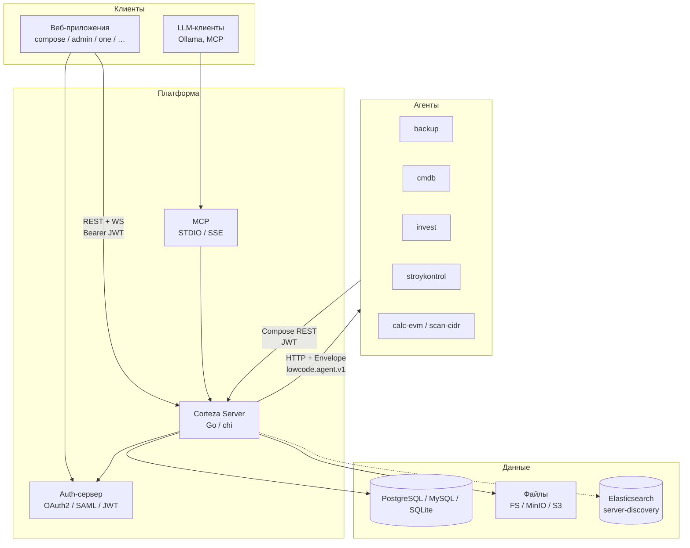
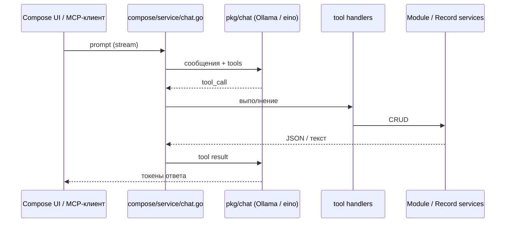
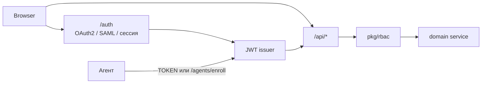

# Архитектура платформы lowcode

Документ описывает устройство репозитория `lowcode` — форка [Corteza](https://cortezaproject.org/) с собственными агентами, цепочками правил, MCP и LLM-интеграцией. Аудитория: разработчики и интеграторы, которым нужно понять, как связаны сервер, веб-приложения и внешние сервисы.

Исходный модуль сервера: `github.com/madnikulin50/lowcode/server` (Go 1.26). Клиентские приложения собраны в `client3/` на Vue 3.

---

## 1. Назначение

Платформа позволяет собирать бизнес-приложения без отдельного бэкенда на каждую предметную область:

- **Compose** — пространства (namespaces), модули (схемы записей), страницы из блоков, графики.
- **System** — пользователи, роли, RBAC, настройки, DAL-подключения, Integration Gateway.
- **Automation** — визуальные workflow, триггеры, сессии исполнения, BPMN.
- **Агенты** — отдельные Go-сервисы (бэкап, CMDB, инвестиции, стройконтроль и др.), которые вызываются из цепочек правил и пишут обратно в Compose.
- **AI** — чат в Compose с tool calling через Ollama, MCP-сервер для внешних LLM-клиентов, узлы ИИ в rule chains.

Всё взаимодействие UI ↔ сервер идёт по REST и WebSocket. Скриптовый рантайм Corredor общается с сервером по gRPC.

---

## 2. Контекст системы



Два основных канала к агентам:

1. **Исходящий** — узел rule chain (HTTP или типизированный `backup/run`, …) вызывает агент.
2. **Входящий** — агент читает и пишет записи Compose по REST; асинхронные джобы шлют прогресс на `callbackUrl`.

---

## 3. Структура репозитория

| Каталог | Роль |
|---------|------|
| `server/` | Монолитный бэкенд Corteza: REST, auth, store, compose, automation, MCP, chat |
| `client3/` | Актуальный фронтенд Vue 3: библиотеки `lib/js`, `lib/vue` и семь SPA в `web/` |
| `lib/` | Публикуемая копия JS-клиента и общий ESLint; Vite-алиасы смотрят в `client3/lib/*/dist` |
| `agents/` | Продуктовые агенты, SDK и микро-скиллы |
| `docker-conf/` | Стенды (`test9`, `test11`) — сервер + агенты |
| `extra/server-discovery/` | Отдельный поисковый сервис на Elasticsearch |
| `def/protobuf/` | gRPC-контракты Corredor и системных сервисов |
| `manual/` | Пользовательская документация Antora (en/ru) |
| `codegen/` (внутри `server/`) | CUE-генерация store, RBAC, options, envoy |

Точка входа сервера: `server/cmd/corteza/main.go` → `app.New().Execute()`.

---

## 4. Сервер

### 4.1. Подсистемы

Сервер — один процесс с несколькими доменными пакетами. Каждый пакет владеет типами, сервисами и REST-роутером.

| Пакет | Назначение | REST-префикс |
|-------|------------|--------------|
| `system/` | Пользователи, роли, настройки, DAL, APIGW, шаблоны, SCIM | `/api/system` |
| `compose/` | Namespaces, модули, записи, страницы, графики, чат, RAG, rule chains | `/api/compose` |
| `automation/` | Workflow, триггеры, сессии, BPMN | `/api/automation` |
| `auth/` | OAuth2, сессии, логин/SAML, HTML UI | `/auth` |
| `federation/` | Экспериментальный обмен записями между инстансами | `/api/federation` |
| `discovery/` | Журнал активности ресурсов | `/api/discovery` |

Общие библиотеки — `server/pkg/`: JWT и identity (`auth`), RBAC, DAL, eventbus, scheduler, wfexec, rulesgo, chat, aiagent, objstore, websocket и др.

### 4.2. Загрузка

Уровни загрузки заданы в `server/app/boot_levels.go`:

| Уровень | Метод | Что происходит |
|---------|-------|----------------|
| Setup | `Setup()` | Sentry, locale, HTTP-клиент, monitor, планировщик eventbus, Corredor, messagebus |
| Store | `InitStore()` | `store.Connect()`, миграции схемы, `initDAL()` |
| Provision | `Provision()` | Системные роли/пользователи, опциональный `provision.Run()` |
| Services | `InitServices()` | JWT/OAuth2, WebSocket, RBAC, затем system → automation → compose → APIGW → federation/discovery |
| Activate | `Activate()` | Watchers сервисов, auth, перезагрузка APIGW, генерация CSS |

Команда `serve` поднимает HTTP-слушатель сразу (для `/healthcheck` и `/version`), затем вызывает `Activate()` и переключает роутер на рабочие маршруты. MCP стартует при активации HTTP-сервера (`pkg/api/server` → `mcp.InitMcp()`).

Порядок инициализации сервисов важен: system даёт identity и настройки, automation регистрирует функции workflow, compose подключает свои хендлеры записей и чат.

### 4.3. HTTP-маршруты

Роутер — [chi](https://github.com/go-chi/chi). Монтирование: `server/app/servers.go`.

```
/assets/*              встроенные и кастомные статические файлы
/webapp/*              SPA (если HTTP_WEBAPP_ENABLED)
/auth/*                auth-сервер
/api/system/*
/api/automation/*
/api/compose/*
/api/websocket/*
/api/discovery/*       опционально
/api/federation/*      опционально
/api/docs/*            OpenAPI
/api/gateway/*         Integration Gateway
/agents/enroll         саморегистрация агентов (если задан AGENT_SHARED_SECRET)
/.well-known/openid-configuration
/scim/*                опционально
```

Защищённые API-группы используют `auth.HttpTokenValidator("api")`. Типичный путь запроса:

```
HTTP → chi → JWT middleware → rest/handlers → rest/request (разбор параметров)
     → service (RBAC + бизнес-логика) → store / DAL → eventbus
     → pkg/api.Send (JSON)
```

---

## 5. Модель Compose

Это ядро low-code: метаданные в обычных таблицах RDBMS, данные записей — в динамических таблицах DAL.

```
Namespace          контейнер приложения (slug в URL: /ns/{slug})
  ├── Module       сущность: поля, конфиг, DAL-модель
  │     └── Record значения полей (RecordValueSet)
  ├── Page         UI: сетка блоков, опциональная привязка к модулю
  │     └── PageLayout
  ├── Chart        сохранённый отчёт / график
  └── RuleChain    цепочка интеграционных узлов (rulesgo)
```

Типы полей модуля: String, Number, DateTime, Select, Bool, User, Record (ссылка), File, URL, Email и др.

Конвейер записи (`compose/service/record.go` + `service/values/`):

1. форматтер → санитайзер → валидатор → детектор дублей;
2. запись через DAL;
3. событие в eventbus (триггеры workflow и rule chains).

Создание/изменение модуля порождает DAL schema alteration (`DefaultDalSchemaAlteration`).

Сервисы: `DefaultNamespace`, `DefaultModule`, `DefaultRecord`, `DefaultPage`, `DefaultPageLayout`, `DefaultChart`, `DefaultChat`, `DefaultRAG`, `DefaultETL`.

---

## 6. Веб-приложения

Актуальный фронтенд — `client3/`. Семь независимых Vite SPA делят две Rollup-библиотеки.

### 6.1. Приложения

| Приложение | Каталог | Роль |
|------------|---------|------|
| compose | `client3/web/compose` | Страницы namespace, билдер, модули, графики, ETL, rule chains |
| admin | `client3/web/admin` | Пользователи, роли, APIGW, автоматизация, федерация, тема UI |
| one | `client3/web/one` | Хаб приложений (`Auth({ app: 'unify' })`) |
| workflow | `client3/web/workflow` | Отдельный редактор workflow |
| reporter | `client3/web/reporter` | Конструктор отчётов |
| discovery | `client3/web/discovery` | Глобальный поиск (через server-discovery) |
| privacy | `client3/web/privacy` | Запросы субъекта данных |

Стек: Vue 3.5, Vue Router 4, Pinia 2, vue-i18n 10, Bootstrap 5, Vite 6. Compose дополнительно подключает bootstrap-vue-next точечно (`BButton`, `BInputGroup`); переключатели — нативные `.form-switch`.

### 6.2. Библиотеки

- **`client3/lib/js`** — доменные типы (Page, Module, Namespace, PageBlock), валидаторы, сгенерированные axios-клиенты из OpenAPI (`server/*/rest.yaml`).
- **`client3/lib/vue`** — плагины Auth / CortezaAPI / Settings / EventBus, 80+ общих компонентов, Pinia-сторы RBAC, уведомлений, черновиков, wf-prompts.

Веб-приложения импортируют `corteza-lib/vue/dist` и `corteza-lib/js/dist` через Vite-алиасы, а не через npm workspaces. `client3/web/vite.singletons.js` принудительно дедуплицирует `vue`, `pinia`, `vue-router`, `vue-i18n`, чтобы не было двух рантаймов Pinia.

### 6.3. PageBlocks

Страница Compose — сетка блоков. Два реестра:

1. **Типы** в `client3/lib/js/src/compose/types/page-block/` — данные и валидация.
2. **Vue-компоненты** в `client3/web/compose/src/components/PageBlocks/` — отображение и конфигуратор.

Функциональный компонент `PageBlock` резолвит вид по `kind + mode` (`Base` / `Configurator` / `Editor`). Общая оболочка — composable `usePageBlockBase` и обёртка `Wrap` (Card / Plain).

Виды блоков: Record, RecordList, RecordEditor, Chart, Metric, Calendar, Geometry, Content, File, IFrame, Navigation, Tabs, Automation, AiChat, RuleChain, Risk, ImageSearch, Report, Progress, Comment, SocialFeed, Variables, RecordOrganizer, RecordRevisions.

Публичный просмотр: `views/Public/Pages/View.vue` → `Public/Page/Grid.vue`. Билдер: `views/Admin/Pages/Builder.vue`.

### 6.4. Состояние и API

Compose-сторы живут в `client3/web/compose/src/store/` (без «s» в имени; старый путь `src/stores` алиасится сюда). Фасад `useStore()` сохраняет Vuex-совместимые `dispatch` / `getters` для мигрировавшего кода.

REST-клиенты создаёт плагин `CortezaAPI('compose'|'system'|…)` (`$ComposeAPI`, `$SystemAPI`). Базовый URL берётся из `window.CortezaAPI` (`public/config.js`, в dev — прокси Vite на `localhost:3333`). Auth-плагин выполняет OAuth2 authorization code + refresh, токены в `localStorage`.

---

## 7. Агенты

Агенты — отдельные процессы рядом с платформой. Пространство Compose (namespace) — продукт; агент — вычислительный контур, который нельзя удобно выразить low-code блоками. Как писать новый агент — в [agents.md](agents.md).

### 7.1. SDK

Пакет `agents/sdk/` задаёт контракт `lowcode.agent.v1`:

| Файл | Роль |
|------|------|
| `service.go` | HTTP: `/health`, `/api/meta`, `/api/jobs`, `/api/call/{op}`, `/api/register` |
| `contract.go` | `Envelope` — статус джобы, прогресс, `items`, алиасы для старых цепочек |
| `compose.go` | REST-клиент Compose (автопоиск origin `/` vs `/api`) |
| `authtoken.go` | `TOKEN` или саморегистрация через `AGENT_SHARED_SECRET` |
| `component.go` | Дескрипторы операций для палитры rule chain (`GET /api/meta`) |

Два режима: синхронный `POST /api/call/{op}` (calc-evm) и асинхронный `POST /api/jobs` с колбэком (scan-cidr, backup, cmdb).

Саморегистрация: агент шлёт `POST /agents/enroll` с заголовком `X-Agent-Secret`; сервер выдаёт JWT на identity `corteza-service` сроком 365 дней (`server/app/agent_enroll.go`). Если секрет не задан, маршрут не монтируется.

### 7.2. Продукты

| Агент | Порт (test9) | Namespace | Назначение |
|-------|--------------|-----------|------------|
| `cmdb` | 8085 | `cmdb` | Сканирование сетей, инвентарь устройств, LLM-классификация, MCP агента |
| `invest` | 8086 | `invest` | WBS, согласования, CPM, RFC, риски; свой chi-роутер без `sdk.Service` |
| `backup` | 8087 | `backup` | Бэкап/restore SMB, БД, S3 → MinIO (restic) |
| `stroykontrol` | 8092 / 8100 | `stroykontrol` | Сравнение ПД/РД: растеризация PDF, iframe в Compose |
| `calc-evm` | 8088 | — | Скилл: SPI/CPI/EAC, без записи в Compose |
| `scan-cidr` | 8089 | — | Скилл: ping/TCP/ARP, результат глотает цепочка `cmdb-ingest-scan` |
| `faris` | — | `faris` | Демо закупок, только Compose (без бинарника) |

Пространства поднимаются идемпотентными скриптами `agents/*/compose/apply.mjs` (модули, страницы, цепочки, роли). Живые ID сохраняются в `applied.json`.

### 7.3. Вызов из платформы

1. Кнопка на странице или событие записи запускает rule chain.
2. Узел HTTP или типизированный узел (`server/compose/rest/rulechain_agent_nodes.go`) бьёт в URL агента.
3. Палитра узлов дополняется дескрипторами с `GET /api/meta`.
4. Асинхронный агент шлёт `Envelope` на `callbackUrl`; ingest-цепочка пишет записи.

---

## 8. Автоматизация

На платформе два контура, которые часто путают.

### 8.1. Workflow (BPMN / Corteza automation)

Пакет `server/automation/`:

- **Workflow** — граф шагов, кэш скомпилированных графов.
- **Trigger** — подписка на eventbus (события записей, интервалы, системные события).
- **Session** — экземпляр исполнения, очередь, WebSocket-промпты.
- Движок: `pkg/wfexec` (шлюзы, итераторы, fork).
- Хендлеры шагов: HTTP, email, JWT, JS env, Corredor, очередь, OAuth2.
- Compose регистрирует хендлеры Records / Modules / Namespaces / Attachment / Notification.
- BPMN компилируется в граф (`automation/service/bpmn_compile.go`).

Corredor — внешний рантайм JS-скриптов по gRPC (`def/protobuf/service-corredor.proto`, `pkg/corredor`).

### 8.2. Rule chains (rulesgo)

Пакет `server/pkg/rulesgo/` — интеграционный движок ближе к iPaaS, чем к BPMN:

- узлы: HTTP, условие, foreach, Kafka, RabbitMQ, 1С (`gonec`), AI operation, CRUD Compose, конвертация форматов, корреляция с automation;
- хранение: таблица `compose_rule_chain`;
- мост в workflow: функция `compose.runRuleChain` (`compose/service/rulechain_bridge.go`);
- триггеры на событиях записей: `StartRuleChainRecordTriggers()`.

Именно rule chains — основной способ вызвать агентов из UI.

---

## 9. AI, чат и MCP



### 9.1. Чат Compose

- Сервис: `server/compose/service/chat.go`.
- Клиент LLM: `server/pkg/chat/client.go` (`cloudwego/eino-ext` → Ollama).
- Модель по умолчанию: `qwen3:8b`, переопределение `CHAT_MODEL` или тег `<model>` в промпте.
- URL Ollama: настройки админки → `OLLAMA_URL` → `OLLAMA_HOST` → `http://127.0.0.1:11434`.
- Роли моделей: `compose.chat`, `mcp.agent`, `automation.chat`, `rulesgo.ai` (`pkg/chat/settings.go`).

Статические инструменты (модули, страницы, графики) описаны в `compose/service/tooldef.go`. Динамические на каждый модуль namespace:

- `show_module_{handle}`, `module_search_{handle}`
- `module_{handle}_records`
- `module_{handle}_create_record` / `_update_record` / `_delete_record`

Мутации требуют подтверждения («да») через guardrails `pkg/aiagent`.

### 9.2. MCP

Инициализация: `server/compose/mcp/index.go`.

- Имя сервера: `lowcode-server`.
- Транспорт: `MCP_STDIO=true` и/или `MCP_SSE_ADDR=:9090`.
- Обработчики: `compose/mcp/handlers/` — namespaces, modules, records, pages, charts, page blocks, mail, rules, agents, 1С (`gonec`), опционально AI-скрипты (`MCP_ENABLE_SCRIPTS`).
- Auth: `withAuth(ctx)` подставляет identity вызывающего; в STDIO возможен fallback на service user.
- `initBridge()` подключает JS-рантайм, 1С, rulesgo, Kafka/RabbitMQ, реестр `aiagent`.

CMDB-агент дополнительно поднимает **свой** MCP (`--mcp=:9091` или stdio) с инструментами сканирования сети.

### 9.3. Прочие AI-контуры

- RAG по страницам: `compose/service` + `pkg/rag`.
- Реестр агентов: `pkg/aiagent` (YAML-спеки в `defs/`, например `risk-analyst.yaml`).
- Байесовский риск-движок: `pkg/riskengine` / `pkg/riskstore`, блок Risk на страницах, инструменты чата `chat_risk_tools.go`.

---

## 10. Хранение данных

### 10.1. Store

Единый интерфейс `store.Storer` (`server/store/interfaces.gen.go`) покрывает метаданные: пользователи, роли, модули, страницы, workflow, RBAC-правила и т.д.

Подключение: `store.Connect()` по DSN (`DB_DSN`):

| Драйвер | Схема DSN |
|---------|-----------|
| PostgreSQL | `postgres://` |
| MySQL | `mysql://` |
| SQLite | `sqlite3://` |
| MSSQL | `mssql://` |
| ClickHouse | DAL |

Миграции на старте при `UPGRADE_ALWAYS=true` (по умолчанию) или командой `corteza upgrade`. Код store генерируется из CUE (`server/codegen/`).

### 10.2. DAL

Записи Compose лежат не в универсальной EAV-таблице, а в моделях Data Access Layer (`pkg/dal/`): на модуль — своя таблица/соединение. Первичное соединение поднимается в `app/boot_dal.go`. Это позволяет вынести «тяжёлые» модули на отдельную БД.

Как завести объект, сохранить и читать: [dal.md](dal.md). Кодген store — `server/codegen/def/` (Go, не CUE) → `make -C server/codegen server`.

### 10.3. Файлы

`pkg/objstore`: файловая система (`STORAGE_PATH`), MinIO/S3 (`MINIO_*`), блобы в БД.

### 10.4. Поиск

`extra/server-discovery/` — отдельный процесс с Elasticsearch. Веб-приложение discovery ходит в него своим плагином `searcher`, не через основной Compose API.

---

## 11. Аутентификация и доступ



- Браузер: authorization code на `/auth`, затем API с Bearer JWT (`pkg/auth`, HS256/RS256).
- Агенты: заранее выпущенный `TOKEN` или shared-secret enroll.
- Идентичность в контексте: `SetIdentityToContext` / `GetIdentityFromContext`.
- RBAC: глобальный сервис `pkg/rbac`, правила в БД, на каждый ресурс — сгенерированный `access_control.gen.go` (`CanReadX`, `CanCreateX`, …).
- Перезагрузка правил: `ac.Reload` + watcher `ac.Watch`.

---

## 12. Развёртывание

Конфигурация — переменные окружения, разобранные в `pkg/options` (CUE → `options.gen.go`). Приоритет: OS env → `--env-file` → `.env` рядом с бинарником. Полный список: `server/.env.example`.

Ключевые переменные:

| Группа | Переменные |
|--------|------------|
| БД | `DB_DSN` |
| HTTP | `HTTP_ADDR`, `DOMAIN`, `HTTP_BASE_URL`, `HTTP_WEBAPP_ENABLED` |
| Auth | `AUTH_SECRET`, `AUTH_BASE_URL`, `AUTH_JWT_ALGORITHM` |
| Файлы | `STORAGE_PATH`, `MINIO_*` |
| AI | `CHAT_MODEL`, `OLLAMA_URL` / `OLLAMA_HOST` |
| MCP | `MCP_STDIO`, `MCP_SSE_ADDR`, `MCP_ENABLE_SCRIPTS` |
| Агенты | `AGENT_SHARED_SECRET` |
| Прочее | `CORREDOR_ADDR`, `FEDERATION_ENABLED`, `DISCOVERY_ENABLED`, `SMTP_*` |

Образы:

- сервер: `docker.io/madnikulin50/pnp-lowcode` (`Dockerfile` в корне и `server/Dockerfile`);
- агенты: `pnp-backup`, `pnp-cmdb`, `pnp-invest`, … (`agents/Makefile.inc`).

Стенды: `docker-conf/test9` (сервер + backup/cmdb/invest/скиллы), `docker-conf/test11` (+ stroykontrol, сдвинутые порты). Агенты достучаются до сервера через `host.docker.internal:${HTTP_PORT}`. Корневой `docker-compose.yml` поднимает только сервер.

Пошаговая инструкция: [deploy.md](deploy.md).

Сборка фронтенда: сначала `client3/lib/js` и `lib/vue` (`yarn build`), затем `make -C client3 build`. Артефакты уезжают в `cdist/webapp/` и упаковываются `server/webapp/Makefile`.

---

## 13. Типовые сценарии

### Просмотр записи на странице

Пользователь открывает `/ns/{slug}/pages/{pageID}/record/{recordID}` → compose SPA грузит namespace/module/page из Pinia → блоки Record/RecordList ходят в `$ComposeAPI` → JWT → `compose/service/record` → DAL → JSON.

### Кнопка «сканировать сеть» в CMDB

Rule chain `cmdb-trigger-scan` → HTTP/узел агента `scan-cidr` или толстый `cmdb` → джоба → `Envelope` на callback → цепочка `cmdb-ingest-scan` создаёт/обновляет записи `devices`, `services`, `vulnerabilities`.

### Чат «создай модуль»

UI стримит `POST /api/compose/namespace/{ns}/chat` → LLM вызывает `create_module` → подтверждение «да» → сервис модуля → store + DAL alteration → ответ в чат.

### Согласование документа в invest

Страница Compose дергает rule chain → `POST` на invest `:8086` (`/api/submit-approval` и др.) → агент читает/пишет модули `documents`, `approvals` через свой Corteza-клиент.

---

## 14. Карта исходников

| Тема | Файлы |
|------|-------|
| Загрузка сервера | `server/cmd/corteza/main.go`, `server/app/boot_levels.go`, `server/app/cli.go`, `server/app/servers.go` |
| Store / DAL | `server/store/connect.go`, `server/app/boot_dal.go`, `server/pkg/dal/` |
| Auth / RBAC | `server/app/boot_auth.go`, `server/auth/auth.go`, `server/pkg/auth/`, `server/pkg/rbac/` |
| Compose-сервисы | `server/compose/service/service.go`, `module.go`, `record.go`, `page.go` |
| Чат / tools | `server/compose/service/chat.go`, `tooldef.go`, `server/pkg/chat/client.go` |
| MCP | `server/compose/mcp/index.go`, `bridge.go`, `handlers/` |
| Workflow | `server/automation/service/workflow.go`, `trigger.go`, `session.go`, `server/pkg/wfexec/` |
| Rule chains | `server/pkg/rulesgo/`, `server/compose/service/rulechain_bridge.go` |
| Агенты enroll | `server/app/agent_enroll.go`, `agents/sdk/authtoken.go` |
| SDK агентов | `agents/sdk/service.go`, `contract.go`, `compose.go` |
| PageBlocks | `client3/web/compose/src/components/PageBlocks/` |
| Vite / алиасы | `client3/web/compose/vite.config.js`, `client3/web/vite.singletons.js` |
| Стенды | `docker-conf/test9/`, `docker-conf/test11/`, `agents/docker-compose.yml` |

---

## 15. Что сознательно вынесено за скобки ядра

По README агентов в текущем дереве **не** входят в платформенное ядро и либо отсутствуют, либо живут только как модель данных:

- УКЭП / КриптоПро, живая синхронизация с 1С, импорт Primavera/MS Project — invest;
- полноценный OCR смет и ИД — stroykontrol (сейчас визуальное сравнение ПД/РД и реестр);
- faris — демонстрационный namespace без Go-агента.

Федерация, SCIM и discovery на сервере включаются флагами и по умолчанию могут быть выключены.
