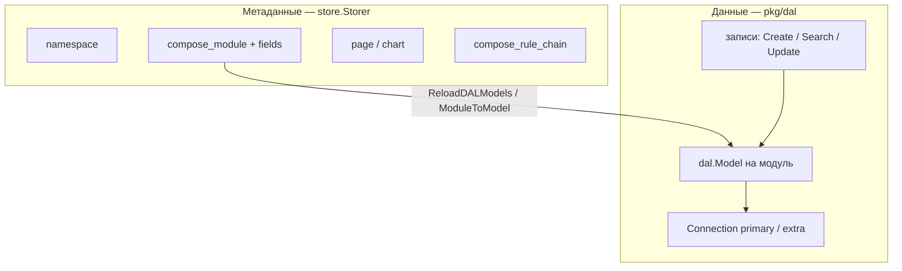

# Объекты, DAL и дальнейшее использование

Как завести новую сущность, сохранить её и читать обратно. Два разных контура, которые часто путают:

1. **Записи Compose** — схема задаётся модулем в UI/`apply.mjs`, данные идут через runtime DAL (`pkg/dal`).
2. **Платформенный объект на Go** — своя таблица, `dal.Model`, store, сервис, REST.

Архитектура хранилища — в [architecture.md](architecture.md). Агенты пишут в Compose REST, не в DAL напрямую — [agents.md](agents.md).

---

## 1. Два слоя



| | Store (`store.Storer`) | DAL runtime (`pkg/dal`) |
|--|------------------------|-------------------------|
| Что лежит | Пользователи, роли, модули, страницы, подключения, rule chains | Строки записей модуля |
| Схема | Статические `dal.Model` в `*/model/` + `store.Upgrade` | Модель строится из полей модуля при старте и при CRUD модуля |
| Таблица | `compose_module`, `compose_rule_chain`, … | `compose_record` или `Config.DAL.Ident` модуля |
| Кто создаёт | Кодген / ручной `init()` | `DefaultModule.ReloadDALModels` |

Запись модуля — **не** строка `store.CreateComposeRecord`. Это `dal.Service().Create(mod.ModelRef(), record)`.

Метаданные модуля — наоборот, store: `store.CreateComposeModule`. После записи сервис вызывает `DalModelReplace`, чтобы DAL узнал новые поля.

---

## 2. Какой путь выбрать

| Задача | Путь |
|--------|------|
| Пользовательская сущность в приложении (клиент, договор, устройство) | Модуль Compose + записи DAL |
| Новая таблица платформы без полного RBAC/кодогена | `dal.Model` в `init()` + `custom_*.go` (как rule chain) |
| Ядро продукта: RBAC, action log, store-тесты, REST CRUD | Ресурс в `codegen/def/` + `make -C server/codegen server` |
| Прототип, нельзя тащить store (циклы импорта) | Своя таблица JSONB, как `pkg/riskstore` |
| Данные снаружи (1С, REST, ES) | Модуль `Config.Type = connector` — DAL-таблицы нет |

Дальше — по этим путям: сначала модуль (самый частый), затем новый Go-объект в DAL, затем кодоген.

---

## 3. Новый объект как модуль Compose

Это «объект» для интегратора и для агента: handle, поля, записи. Таблицу и колонки поднимает DAL.

### 3.1. Создать модуль

UI: Compose → Admin → Modules → Create.

Или REST / `apply.mjs`:

```javascript
const devices = await ensureModule(api, nsID, {
  name: 'Устройства',
  handle: 'devices',
  fields: [
    { name: 'Имя', handle: 'hostname', kind: 'String' },
    { name: 'IP', handle: 'ip_address', kind: 'String' },
    { name: 'Статус', handle: 'status', kind: 'Select', options: ['online', 'offline'] },
  ],
})
```

Сервер: `compose/service/module.go` → `Create` → `store.CreateComposeModule` + поля → `DalModelReplace`.

### 3.2. Что DAL делает со схемой

`ModuleToModel` (`compose/service/module.go`):

- `Ident` таблицы: `mod.Config.DAL.Ident`, иначе ident соединения (у primary по умолчанию `compose_record`). Плейсхолдеры `{{namespace}}`, `{{module}}` заменяются на slug/handle.
- Пользовательские поля → `dal.Attribute` (`moduleFieldToAttribute`). По умолчанию значения в JSON-колонке `values` (`CodecRecordValueSetJSON`); поле можно вынести в свою колонку (`CodecPlain` / `CodecAlias`).
- Системные атрибуты: `id`, связь с модулем/namespace, owner, timestamps, `values`.
- `ModelRef`: `ConnectionID`, `ResourceID` (ID модуля), `ResourceType` модуля — этим ключом потом идут все DML.
- `Type == connector` — модель не строится, записей в DAL нет.
- `Type == dbref` — `Static = true`, упрощённая модель.

При старте: `Activate` → `ReloadDALModels` → для каждого namespace `DalModelReplace` → `dal.Service().ReplaceModel`.

Если DDL ещё не применён (новая колонка, индекс), `ReplaceModel` возвращает `[]*dal.Alteration`. Их пишет `DefaultDalSchemaAlteration.SetAlterations` в `dal_schema_alteration`. В админке System → DAL alterations → Apply → `dal.Service().ApplyAlteration`.

В dev часть изменений может примениться сразу. Не рассчитывайте, что «сохранил модуль — колонка уже в Postgres»: смотрите очередь alterations.

### 3.3. Соединения

Primary поднимается в `app/boot_dal.go`:

- строка `DalConnection` с handle primary;
- обёртка над тем же RDBMS, что `store` (`Store.ToDalConn()`);
- default ident: `compose_record`.

Дополнительные БД: System → DAL connections (`system/service/dal_connection.go`). У модуля в `Config.DAL` указывают `ConnectionID`. Тяжёлые модули можно вынести с primary.

Уровни чувствительности (`dal-sensitivity-level`) вешаются на connection / model / attribute. Доступ только если уровень пользователя не ниже уровня ресурса.

### 3.4. Запись и чтение

Конвейер (`compose/service/record.go` + `compose/dalutils/records.go`):

```
REST / агент / чат
  → Record.Create / Update / Find
    → санитайзер, валидатор, детектор дублей
    → dalutils.ComposeRecordCreate(ctx, dal, module, record)
      → dal.Service().Create(ctx, module.ModelRef(), ops, record)
    → eventbus (workflow, rule chains)
```

`types.Record` реализует `dal.ValueGetter` / `ValueSetter`. Поиск: `ComposeRecordsList` / `Find` / `Count` с QL-фильтром модуля.

Дальше запись используют:

| Кто | Как |
|-----|-----|
| Страницы Compose | блоки Record / RecordList |
| Rule chain | узлы `crud` (`operation: create\|update\|search`) |
| Чат / MCP | `module_{handle}_create_record` и т.д. |
| Агент | `sdk.Client.CreateValues(ctx, "devices", map[string]string{…})` |
| Workflow | compose record handlers |

Не ходите в таблицу `compose_record` сырым SQL из агента: ident и кодек могут отличаться у модуля.

---

## 4. Новый объект на Go и таблица в DAL

Нужна сущность платформы (не «ещё один модуль»), но полный кодоген избыточен. Эталон в этом репозитории — **rule chain**.

### 4.1. Модель — DDL при upgrade

Зарегистрируйте `dal.Model` в `init()`, чтобы `store.Upgrade` → `createTablesFromModels(composeModels.Models())` создал таблицу.

Файл: `compose/model/rulechain.go` (срез `models` из `models.gen.go`).

```go
func init() {
    models = append(models, &dal.Model{
        Ident: "compose_rule_chain",
        Attributes: dal.AttributeSet{
            {Ident: "ID", Type: &dal.TypeID{}, Store: &dal.CodecAlias{Ident: "id"}, PrimaryKey: true},
            {Ident: "Handle", Type: &dal.TypeText{Length: 128}, Store: &dal.CodecAlias{Ident: "handle"}},
            {Ident: "NamespaceID", Type: &dal.TypeID{}, Store: &dal.CodecAlias{Ident: "rel_namespace"}},
            {Ident: "Nodes", Type: &dal.TypeJSON{DefaultValue: "[]"}, Store: &dal.CodecAlias{Ident: "nodes"}},
            // CreatedAt / UpdatedAt / DeletedAt — как в rulechain.go
        },
        Indexes: dal.IndexSet{
            {Ident: "PRIMARY", Type: "BTREE", Fields: []*dal.IndexField{{AttributeIdent: "ID"}}},
        },
    })
}
```

`Ident` атрибута — имя в Go-типе; `CodecAlias.Ident` — колонка SQL. Типы: `TypeID`, `TypeText`, `TypeJSON`, `TypeTimestamp`, `TypeNumber`, `TypeBoolean`, `TypeRef`, …

После деплоя перезапустите сервер (или `corteza upgrade`). Новая таблица появится, если модели ещё не было. Изменение колонок у **ручных** моделей upgrade не всегда мигрирует как alterations модулей — закладывайте совместимость или пишите SQL сами.

### 4.2. Тип и store

- `compose/types/<entity>.go` — структура, фильтр, `ToEngine` / `FromEngine` при необходимости.
- `store/adapters/rdbms/custom_<entity>.go` — goqu: `CreateX`, `UpdateX`, `SearchX`, `LookupXByHandle`. Смотрите `custom_rule_chains.go` (`ruleChainTable`, `ruleChainRow`, маппинг JSONB).

Интерфейса в `store.Storer` не будет, пока не прогоните кодоген. Сервис вызывает `rdbms.SearchRuleChains(ctx, rdbmsStore(DefaultStore), filter)`.

### 4.3. Сервис и использование

`compose/service/rulechain_persist.go`: адаптер `rulesgo.Persistence` — `LoadChains`, `SaveChain`. REST: `compose/rest/rulechain.go`. Мост в MCP/чат — те же сервисы.

Типичный цикл:

```
HTTP / MCP / apply.mjs
  → service.Save
    → rdbms.CreateRuleChain / Update
  → движок читает LoadChains при старте или по событию
```

Дальше объект можно:

- отдать в REST как обычный ресурс;
- подписать на eventbus;
- вызвать из workflow-функции (`compose.runRuleChain`);
- показать блоком на странице (RuleChain).

Не дублируйте ту же сущность модулем Compose «на всякий случай»: две схемы разъедутся.

### 4.4. Чеклист ручного DAL-объекта

1. Go-тип + `dal.Model` в `init()`.
2. `custom_*.go` с CRUD.
3. Сервис (транзакции через `store.Tx`, если пишете вместе с другими store-сущностями — у кастомного SQL это сложнее, чем у кодогена).
4. REST или внутренний адаптер.
5. Рестарт / upgrade — таблица на месте (`\d compose_rule_chain`).
6. Тест store, если логика не тривиальна.

---

## 5. Полный кодоген (платформенная сущность)

Когда нужны RBAC (`CanReadX`), action log, сгенерированный `store.CreateFoo`, тесты store.

Схемы больше не в CUE: `server/codegen/def/compose.go`, `system.go`, …

```go
{Handle: "module", Resource: Resource{
    Parents: []ParentRef{{Handle: "namespace"}},
    Model: Model{
        Ident:      "compose_module",
        Attributes: AttributesFromStruct(composetypes.Module{}),
        Indexes:    map[string]Index{ /* primary, unique_handle */ },
    },
    Store: &StoreConfig{Ident: "composeModule", Lookups: []StoreLookup{…}},
    Rbac:  &Rbac{Operations: map[string]RbacOperation{"read": {}, "update": {}}},
}}
```

```bash
make -C server/codegen server
```

Появятся типы, `models.gen.go`, куски `store/interfaces.gen.go` и `rdbms/*.gen.go` (через `mergestore` — не затирает ручные сущности вроде rule chain).

Дальше вручную: `service/*.go`, `rest/*.go`, вызов `Initialize`. Таблица — снова `store.Upgrade` по сгенерированной модели.

Не запускайте кодоген «на всякий случай» после ручного `custom_*.go` без просмотра diff: mergestore бережёт непортированные сущности, но конфликт имён таблиц/типов вы не хотите.

---

## 6. Ключевые типы DAL

| Тип | Файл | Зачем |
|-----|------|--------|
| `dal.Model` | `pkg/dal/model.go` | Таблица: `Ident`, `Attributes`, `Indexes`, `ConnectionID` |
| `dal.Attribute` | там же | Поле: `Type`, `Store` (кодек), PK, sortable/filterable |
| `dal.ModelRef` | там же | Ключ DML: connection + resource модуля |
| `dal.ValueGetter` / `ValueSetter` | `pkg/dal/driver.go` | Как запись отдаёт/принимает значения |
| `dal.Connection` | `driver.go` | Драйвер: Create/Search/CreateModel |
| `dal.Alteration` | `alteration.go` | Отложенный DDL |
| `store.Storer` | `store/interfaces.gen.go` | Все платформенные CRUD + `ToDalConn()` |

Глобальный рантайм: `dal.Service()` после `dal.SetGlobal` в `initDAL`. Операции: `ReplaceModel`, `Create`, `Update`, `Search`, `Lookup`, `Delete`, `ApplyAlteration`.

---

## 7. Что не класть в DAL

- Секреты источников — env агента (`BACKUP_SECRET_*`), не поля модуля и не JSON цепочки.
- Файлы — `pkg/objstore` (диск / MinIO), в записи только attachment ID.
- Эксперимент с циклом импорта `compose/rest` ↔ `pkg` — `riskstore` (своя `sql.DB`, JSONB). Потом либо вынести в путь §4, либо оставить изолированным.

---

## 8. Типичные ошибки

| Симптом | Причина |
|---------|---------|
| Модуль есть, записей «нет таблицы» | Не применены DAL alterations; другой `ConnectionID` / `Ident` |
| Агент пишет, UI пустой | Другой namespace/handle; пишете в JSON `values`, а список фильтрует колонку |
| `ReplaceModel` тихий | Connector-модуль пропускается |
| Новая Go-таблица не появилась | Модель не в `models` slice; сервер без upgrade |
| Две схемы одной сущности | И модуль Compose, и `custom_*.go` |
| Сырой SQL в `compose_record` | У модуля свой ident или codec |

---

## 9. Карта исходников

| Тема | Путь |
|------|------|
| Init DAL | `server/app/boot_dal.go` — `initDAL`, `provisionPrimaryDalConnection` |
| Upgrade таблиц | `server/store/adapters/rdbms/upgrade.go` — `createTablesFromModels` |
| Runtime | `server/pkg/dal/service.go`, `model.go` |
| Модуль → модель | `compose/service/module.go` — `ReloadDALModels`, `ModuleToModel` |
| Записи | `compose/service/record.go`, `compose/dalutils/records.go` |
| Alterations | `system/service/dal_schema_alteration.go` |
| Соединения | `system/service/dal_connection.go` |
| Кодоген | `server/codegen/def/compose.go`, `make -C server/codegen server` |
| Эталон ручной таблицы | `compose/model/rulechain.go`, `store/adapters/rdbms/custom_rule_chains.go`, `compose/service/rulechain_persist.go` |
| Изолированный store | `pkg/riskstore/store.go` |
