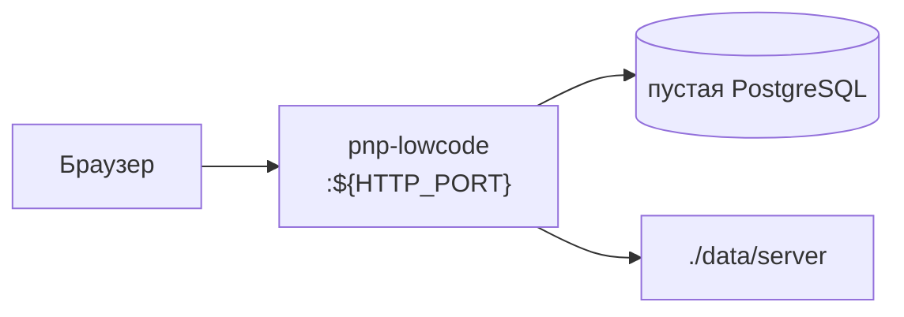

# Чистое развёртывание

Платформа **без продуктовых пространств и без агентов**: пустой Compose, стандартные webapp (one / compose / admin / workflow / reporter / privacy / discovery). Пространства `backup`, `cmdb`, `invest`, `stroykontrol` и вызовы `apply.mjs` **не входят**.

Стенд с агентами и готовыми namespace — в [deploy.md](deploy.md). Архитектура — в [architecture.md](architecture.md).



После старта: регистрация первого пользователя → хаб приложений → в Compose список пространств пустой. Модули и страницы создаются в UI (или позже отдельным apply — это уже не чистое развёртывание).

---

## 1. Что поднимается и что нет

| Есть | Нет |
|------|-----|
| Образ `pnp-lowcode` (API + webapp) | Агенты backup / cmdb / invest / stroykontrol / calc-evm / scan-cidr |
| Миграции схемы на пустую БД | `agents/*/compose/apply.mjs` и `seed.mjs` |
| Auth, RBAC, системные роли | MinIO, rule chains продуктов |
| Том вложений `./data/server` | Готовые namespace в `/ns/…` |

Ollama не обязательна: без неё UI работает, чат и LLM-узлы — нет.

Compose-файл: корневой [`docker-compose.yml`](../docker-compose.yml) — один сервис `server`. Не используйте `docker-conf/test9` и `test11`: там сразу агенты.

---

## 2. Требования

- Docker Engine + Compose v2
- PostgreSQL 13+ на хосте (в compose его нет)
- свободный порт для UI (ниже — `28080`)
- IPv4 хоста в LAN для `LOCAL` (из контейнера `127.0.0.1` — это сам контейнер)

---

## 3. Пустая база

Отдельная БД, не `test9` / `test11` с уже накатанными пространствами.

```sql
CREATE DATABASE lowcode;
```

Пользователь из `DB_DSN` должен уметь создавать таблицы. Схема появится при первом `serve-api`.

```bash
psql "postgres://postgres@127.0.0.1:5432/lowcode?sslmode=disable" -c 'SELECT 1'
```

---

## 4. `.env` в корне репозитория

Корневой compose читает `.env` рядом с собой. Минимальный файл:

```bash
VERSION=2026.09.20

# Как браузер открывает UI. С других машин — LAN IP, не localhost.
DOMAIN=<LAN-IP>:28080
LOCAL=<LAN-IP>
HTTP_PORT=28080

DB_DSN=postgres://<user>:<password>@host.docker.internal:5432/lowcode?sslmode=disable
DB_USER=<user>
DB_PASSWORD=<password>
DB_NAME=lowcode

HTTP_API_ENABLED=true
HTTP_BASE_URL=/
ENVIRONMENT=dev
LOCALE_LANGUAGES=ru
ACTIONLOG_ENABLED=false
```

`LOCAL` — тот же LAN-IP: Docker прописывает `host.docker.internal` на него.

Не задавайте `AGENT_SHARED_SECRET` и `TOKEN`: агентов нет.

Образ уже включает webapp (`HTTP_WEBAPP_ENABLED=true`). Пути к SPA прописывать не нужно.

Для стабильных JWT между перезапусками можно добавить `AUTH_JWT_SECRET` (случайная длинная строка). Иначе секрет берётся из настроек/дефолтов сервера.

---

## 5. Запуск

Из корня репозитория:

```bash
docker compose pull
docker compose up -d
docker compose ps
docker compose logs -f server
```

Дождитесь healthcheck (в образе `start-period` — 1 минута: идёт upgrade схемы):

```bash
curl -fsS "http://127.0.0.1:${HTTP_PORT}/healthcheck"
```

UI: `http://<DOMAIN>/`  
API: `http://<DOMAIN>/api/` (при включённом webapp API уезжает на `/api`).

Остановка:

```bash
docker compose stop          # контейнер, данные на месте
docker compose down          # контейнер; ./data/server остаётся
```

База PostgreSQL compose не трогает.

---

## 6. Первый пользователь

В `ENVIRONMENT=dev` откройте UI и зарегистрируйтесь (signup). Первый пользователь попадает в bypass/admin-роли provision.

Либо до **первого** старта в `.env`:

```bash
AUTH_PROVISION_SUPER_USER=admin@example.com
```

Пароль — тот же email. В `ENVIRONMENT=prod` эта переменная останавливает сервер с ошибкой — так задумано.

Дальше: **One** → **Low Code** (Compose). Список пространств пустой — это ожидаемый результат чистого развёртывания. Пространство, модули и страницы создаются кнопками в Compose.

Admin: пользователи, роли, настройки. Workflow editor — без заранее загруженных процессов.

---

## 7. Образ с Docker Hub или свой

По умолчанию:

```text
docker.io/madnikulin50/pnp-lowcode:${VERSION}
```

Сборка у себя (бинарь + SPA + docker build + push):

```bash
make drelease VERSION=2026.09.20
```

Только локальный тег `pnp-lowcode:$VERSION` (без Hub): сначала `make -C client3 build`, затем `make ddebug VERSION=…`. Compose для локального тега — [`docker-debug/docker-compose.yml`](../docker-debug/docker-compose.yml) (`image: pnp-lowcode:${VERSION}`). `.env` тот же по смыслу, кладётся в `docker-debug/`.

```bash
cd docker-debug
docker compose up -d
```

---

## 8. Опционально: Ollama

Чат и tool calling без Ollama не работают, остальной UI — да.

```bash
ollama serve
ollama pull qwen3:8b
```

В `.env` сервера:

```bash
OLLAMA_URL=http://host.docker.internal:11434
```

Пересоздать контейнер после правки: `docker compose up -d`.

---

## 9. Чего не делать

- Не запускайте `agents/*/compose/apply.mjs` и `seed.mjs` — они создадут продуктовые namespace.
- Не копируйте `.env` из `docker-conf/test9` или `test11`: там порты агентов, `AGENT_SHARED_SECRET` и чужие `DB_NAME`.
- Не указывайте в `DB_DSN` базу, в которой уже лежат `backup` / `cmdb` / `invest`. Для чистого инстанса — новая пустая БД.
- Не монтируйте `docker-conf/*/docker-compose.yml`: кроме сервера поднимутся агенты.

Когда понадобятся готовые пространства и агенты — [deploy.md](deploy.md). `apply.mjs` можно накатить и на этот же сервер позже; с этого момента инстанс уже не «чистый».

---

## 10. Типичные проблемы

**Не видит Postgres.** В `DB_DSN` внутри контейнера должен быть `host.docker.internal`, а `LOCAL` — LAN-IP хоста. `127.0.0.1` в DSN из контейнера указывает на контейнер.

**healthcheck долго красный.** Идёт `store.Upgrade`. Смотрите `docker compose logs server`. Пользователь БД без права DDL — миграции падают.

**UI 404 / нет SPA.** Нужен образ, собранный с `client3/web/*/dist` (Hub-образ `pnp-lowcode` уже содержит webapp). Не задавайте одинаковый base URL у API и webapp.

**Signup закрыт.** В production signup по умолчанию уже. Для первого админа либо `ENVIRONMENT=dev`, либо `AUTH_PROVISION_SUPER_USER` **до** первого старта.

**В Compose уже есть пространства.** БД не пустая. Смените `DB_NAME` / `DB_DSN` на новую базу или очистите схему осознанно (`DROP SCHEMA public CASCADE` — необратимо).
