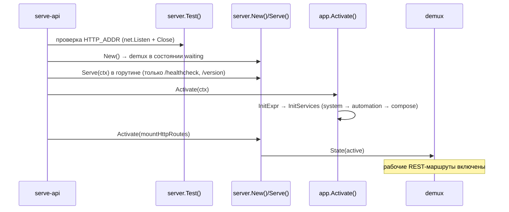
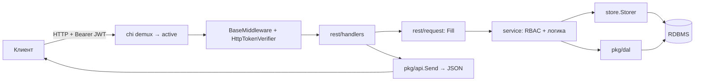
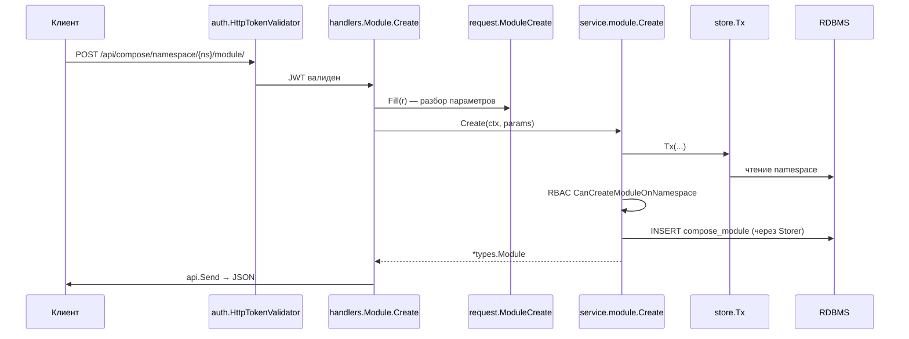

# Схема работы REST API

Документ описывает, как в серверной части (`server/`) регистрируются CLI-команды, как стартует HTTP-сервер, как устроена обработка REST-запроса и как запрос доходит до базы данных. Аудитория: разработчики, которым нужен сквозной путь «команда → сервер → роут → сервис → БД».

См. также: [architecture.md](architecture.md) (общая архитектура платформы), [dal.md](dal.md) (слой данных).

---

## 1. Точка входа и регистрация команд

Точка входа — `server/cmd/corteza/main.go`:

```go
func main() {
	logger.Init()
	cli.HandleError(app.New().Execute())
}
```

`app.New()` создаёт `CortezaApp` и сразу вызывает `InitCLI()` (`server/app/cli.go`), который:

1. собирает корневую команду (`cli.RootCommand`);
2. загружает переменные окружения (`cli.LoadEnv` → `godotenv`);
3. инициализирует опции (`options.Init()`);
4. регистрирует все подкоманды через `Command.AddCommand(...)`.

### 1.1. Базовые команды (`server/pkg/cli/commands.go`)

| Команда | Функция | Назначение |
|---|---|---|
| — (root) | `RootCommand` | общий `PersistentPreRunE`; пропускает инициализацию для `help`/`version` |
| `serve-api` (`serve`) | `ServeCommand` | поднимает HTTP-сервер с REST API |
| `upgrade` | `UpgradeCommand` | инициализирует store и выполняет миграции |
| `provision` | `ProvisionCommand` | применяет конфигурацию/пресеты |
| `version` | `VersionCommand` | печатает версию |

`RootCommand` принимает колбэк `ppRunEfn`, который выполняется на каждой команде, кроме перечисленных в карте `light` (`help`, `version`). Флаг `--env-file` задаёт файлы/каталоги с `.env`; загруженные значения **не переопределяют** уже установленные переменные окружения.

### 1.2. Регистрация подкоманд (`server/app/cli.go`)

```go
app.Command.AddCommand(
	systemCommands.Users(...), systemCommands.Roles(...),
	systemCommands.RBAC(...), systemCommands.Sink(...),
	systemCommands.Settings(...), systemCommands.Import(...),
	systemCommands.Export(...),
	serveCmd, upgradeCmd, provisionCmd,
	authCommands.Command(...),
	federationCommands.Sync(...),
	composeCommands.Base(...),
	cli.EnvCommand(), cli.VersionCommand(),
)
```

- `system` — пользователи, роли, RBAC, sink, настройки, import/export;
- `auth` — OAuth2-клиенты и токены;
- `federation` — `sync`;
- `compose` (`cmp`) — подкоманда `records` (см. `server/compose/commands/`);
- `env` / `version` — диагностика.

Каждая команда — отдельный `*cobra.Command`; `app.Execute()` запускает выбранную. Дерево команд строится декларативно, а бизнес-логика подставляется колбэками (`RunE`), поэтому `cli.go` остаётся схемой сборки, а не местом реализации.

---

## 2. Старт сервера

Команда `serve-api` (см. `server/app/cli.go`) выполняется так:



### 2.1. Демультиплексор состояний (`server/pkg/api/server/`)

HTTP-сервер стартует **раньше**, чем сервисы готовы. Переключение маршрутов обеспечивает `demux` (`demux.go`) с тремя состояниями (`server.go`):

| Состояние | Роуты | Поведение |
|---|---|---|
| `waiting` | `waitingRoutes` | `/version`, `/healthcheck`; остальное → 503 «initializing» |
| `active` | `activeRoutes` | полноценный REST API |
| `shutdown` | `shutdownRoutes` | всё → 503 «shutting down» |

`ServeHTTP` выбирает роутер по текущему состоянию (`atomic.Uint32`), поэтому смена состояния потокобезопасна. `Activate(mm ...func(chi.Router))` собирает `activeRoutes`, инициализирует MCP (`mcp.InitMcp()`) и переключает состояние.

### 2.2. Уровни загрузки (`server/app/boot_levels.go`)

`Activate()` последовательно проходит уровни; каждый идемпотентен и фиксируется в `app.lvl`:

| Уровень | Метод | Что делает |
|---|---|---|
| Setup | `Setup()` | Sentry, locale, monitor, scheduler, Corredor, messagebus |
| Store | `InitStore()` | `store.Connect()`, миграции (`UPGRADE_ALWAYS`), `initDAL()` |
| Provision | `Provision()` | системные роли/пользователи, опциональный `provision.Run()` |
| Services | `InitServices()` | JWT/OAuth2, WebSocket, RBAC, system → automation → compose → APIGW → federation/discovery |
| Activate | `Activate()` | watchers сервисов, auth, перезагрузка APIGW, генерация CSS |

Порядок принципиален: system даёт identity и настройки → automation регистрирует функции workflow → compose подключает записи, чат и RAG.

### 2.3. Жизненный цикл и остановка

`server.Serve` (`server/pkg/api/server/server.go`):

1. `net.Listen` по `HTTP_ADDR` (default `:80`);
2. `http.Server{Handler: demux, BaseContext: ctx}` — корневой `ctx` становится базовым для всех запросов, отмена прокидывается вниз;
3. `<-ctx.Done()` — при отмене контекста сервер переходит в `shutdown` и останавливается.

---

## 3. Монтирование REST-маршрутов

Маршруты монтирует `app.mountHttpRoutes` (`server/app/servers.go`), который передаётся в `HttpServer.Activate`. Роутер — [chi](https://github.com/go-chi/chi).

```
/assets/*                 встроенные и кастомные статики
/webapp/*                 SPA (если HTTP_WEBAPP_ENABLED)
/auth/*                   auth-сервер
/agents/enroll            саморегистрация агентов (AGENT_SHARED_SECRET)
/{baseUrl}/               базовая группа API
  {apiBaseUrl}/system/*
  {apiBaseUrl}/automation/*
  {apiBaseUrl}/compose/*
  {apiBaseUrl}/websocket/*
  {apiBaseUrl}/discovery/*     (опционально)
  {apiBaseUrl}/federation/*    (опционально)
  {apiBaseUrl}/docs, /manual, /architecture
  {apiBaseUrl}/gateway/*
/scim/*                   (опционально)
/.well-known/openid-configuration
```

Дефолты: `HTTP_BASE_URL=/`, `HTTP_API_BASE_URL=/`, `HTTP_ADDR=:80`. Если включены webapp **и** API на одном корне, `ApiBaseUrl` автоматически переносится в `/api` (`options/HTTPServer.go`).

Цепочка middleware для API (`activeRoutes` в `pkg/api/server/handlers.go`):

```
sentryMiddleware → metricsMiddleware (опц.) → BaseMiddleware (CORS, RealIP,
RequestID, context-logger) → LogRequest/LogResponse (опц.) → auth.HttpTokenVerifier
```

Доменные пакеты вешают свои роутеры, напр.:

```go
r.Route("/compose", composeRest.MountRoutes())
```

Внутри `composeRest.MountRoutes()` (`server/compose/rest/router.go`) приватные группы дополнительно защищены `auth.HttpTokenValidator("api")`, после чего регистрируются хендлеры namespace / module / record / page / chart / chat и др.

---

## 4. Взаимодействие с сервером (путь запроса)



### 4.1. Слой хендлеров (генерируется)

Хендлеры REST генерируются из `rest.yaml`, напр. `server/compose/rest/handlers/module.go`. Каждый метод делает три вещи:

1. разбирает параметры в структуру `request.*` (`params.Fill(r)`);
2. вызывает метод внутреннего API-интерфейса (`ModuleAPI`);
3. отправляет результат через `api.Send(w, r, value)`.

`MountRoutes` объявляет URL-шаблоны, напр. для модуля (внутри `/api/compose`):

| Метод | Путь | Действие |
|---|---|---|
| GET | `/namespace/{namespaceID}/module/` | список |
| POST | `/namespace/{namespaceID}/module/` | создание |
| GET | `/namespace/{namespaceID}/module/{moduleID}` | чтение |
| POST | `/namespace/{namespaceID}/module/{moduleID}` | обновление |
| DELETE | `/namespace/{namespaceID}/module/{moduleID}` | удаление |

### 4.2. Слой сервисов

Сервис (`server/compose/service/`) содержит доменную логику, RBAC и работу с событиями. Пример `module.Create`:

```go
func (svc module) Create(ctx context.Context, new *types.Module) (*types.Module, error) {
	var (
		ns     *types.Namespace
		aProps = &moduleActionProps{module: new}
	)

	err := store.Tx(ctx, svc.store, func(ctx context.Context, s store.Storer) (err error) {
		if !handle.IsValid(new.Handle) {
			return ModuleErrInvalidHandle()
		}
		if ns, err = loadNamespace(ctx, s, new.NamespaceID); err != nil {
			return err
		}
		if !svc.ac.CanCreateModuleOnNamespace(ctx, ns) {
			return ModuleErrNotAllowedToCreate()
		}
		// before-create скрипты через eventbus → проверка уникальности → запись в store
		...
	})
	...
}
```

Ключевое: проверка прав (`svc.ac.*`), событие `event.ModuleBeforeCreate` через eventbus и запись — всё внутри одной транзакции `store.Tx`. Глобальные сервисы доступны как `DefaultModule`, `DefaultRecord`, `DefaultPage`, `DefaultChat` и т.д. (`compose/service/service.go`).

### 4.3. Формат ответа (`pkg/api`)

`api.Send(w, r, ...)` кодирует первый непустой аргумент, а ошибки отправляются через `encode` с корректным HTTP-статусом (`server/pkg/api/response.go`). Сервис возвращает либо объект, либо `error` — хендлеру не нужно самому формировать JSON.

---

## 5. Взаимодействие с БД

### 5.1. Подключение к store

Метаданные (пользователи, роли, модули, страницы, RBAC) хранятся в store. Подключение — `store.Connect(ctx, log, dsn, isDev)` (`server/store/connect.go`):

1. определяет тип по схеме DSN (`postgres://` → `postgres`);
2. ищет зарегистрированный коннектор в реестре `registered[storeType]`;
3. если коннектор есть — вызывает его; иначе возвращает ошибку «unknown store type».

Регистрация драйвера выполняется через `init()` в пакете драйвера:

```go
func init() {
	store.Register(Connect, SCHEMA, debugSchema)
	sql.Register(debugSchema, sqlmw.Driver(new(pq.Driver), instrumentation.Debug()))
}
```

Драйверы подключаются blank-импортами в `server/app/store.go`, поэтому регистрируют себя в общий реестр уже при старте:

```go
_ ".../store/adapters/rdbms/drivers/postgres"
_ ".../store/adapters/rdbms/drivers/mysql"
_ ".../store/adapters/rdbms/drivers/sqlite"
_ ".../store/adapters/rdbms/drivers/mssql"
```

| Драйвер | Схема DSN |
|---|---|
| PostgreSQL | `postgres://` |
| MySQL | `mysql://` |
| SQLite | `sqlite3://` (обычно только тесты) |
| MSSQL | `mssql://` |
| ClickHouse | DAL-коннектор |

### 5.2. Инициализация и миграции

`app.InitStore` (`server/app/boot_levels.go`):

- `store.Connect` по `DB_DSN`;
- при `UPGRADE_ALWAYS=true` — `store.Upgrade` (схема метаданных);
- `initDAL` (`server/app/boot_dal.go`) — создаёт/загружает первичное DAL-подключение и инициализирует `dal.Service()`.

### 5.3. Транзакции

Транзакции идут через `store.Tx(ctx, s, fn)` (`server/store/tx.go`): функция получает `store.Storer` в рамках транзакции, поэтому вся бизнес-операция сервиса выполняется атомарно — успех или полный откат.

### 5.4. DAL для записей Compose

Записи модулей лежат не в универсальной EAV-таблице, а в динамических таблицах Data Access Layer (`server/pkg/dal/`): на модуль — своя модель/таблица. Создание или изменение модуля порождает **DAL schema alteration** (`DefaultDalSchemaAlteration`). Подробнее — [dal.md](dal.md).

### 5.5. Полный путь: создание модуля



---

## 6. Карта исходников

| Тема | Файлы |
|---|---|
| Точка входа | `server/cmd/corteza/main.go` |
| Регистрация команд | `server/pkg/cli/commands.go`, `server/pkg/cli/env.go`, `server/app/cli.go` |
| Старт и состояния сервера | `server/pkg/api/server/server.go`, `demux.go`, `handlers.go` |
| Загрузка подсистем | `server/app/boot_levels.go`, `boot_dal.go`, `store.go` |
| Монтирование REST | `server/app/servers.go` |
| Роутеры пакетов | `server/compose/rest/router.go`, `server/system/rest/`, `server/automation/rest/` |
| Хендлеры и запросы | `server/*/rest/handlers/`, `server/*/rest/request/` |
| Сервисы | `server/compose/service/service.go`, `module.go`, `record.go` |
| Store и подключение | `server/store/connect.go`, `tx.go`, `adapters/rdbms/` |
| DAL | `server/app/boot_dal.go`, `server/pkg/dal/` |
| Формат ответа | `server/pkg/api/response.go` |

---

## 7. Концепции для углубления

- **cobra** — дерево команд и `PersistentPreRunE`.
- **chi** — монтирование роутеров, группы, middleware.
- **Демультиплексор состояний** — почему сервер стартует раньше сервисов и как переключаются маршруты.
- **Реестр драйверов через `init()`** — как `store.Connect` находит нужную БД.
- **RBAC + eventbus в сервисном слое** — почему бизнес-логика не живёт в хендлерах.
- **store vs DAL** — метаданные отдельно, записи отдельно.
- **Транзакции `store.Tx`** — граница атомарности операции.
